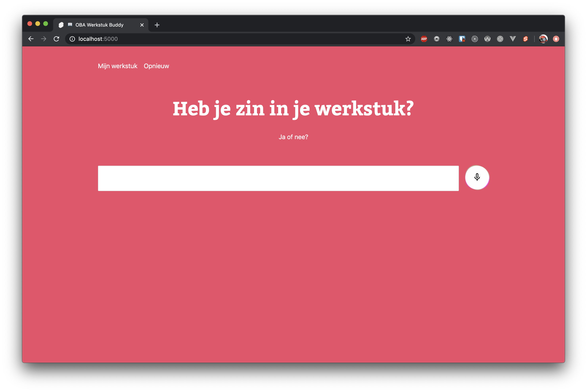

# OBA werkstuk generator
Generate an assignment (werkstuk) by answering simple questions.
> :warning: Highly experimental, only works in Chrome because of using the Web Speech API

## Features
- [Svelte](https://svelte.dev/)
- [Web speech API](https://developer.mozilla.org/en-US/docs/Web/API/Web_Speech_API/Using_the_Web_Speech_API)

## Getting started
### Prerequisites
Before going any further, make sure you've installed the following, got this already? Skip to **Local development**.
- [Node.js]()
- [Yarn]() (or `npm` if you want to)

### Installation
```bash
# Clone the project
git clone https://github.com/kriskuiper/project-1-1920.git

# Install dependencies
yarn install
```

## Local development
After you've opened up your cli and did all of the above:
- `yarn dev` => opens a dev environment on localhost:5000
- `yarn now:dev` => you can use [serverless functions](https://zeit.co/docs/v2/serverless-functions/introduction) in development (if you have an account on [Zeit Now](https://zeit.co/home)), runs on localhost:5001

## Build and production
- Building is done by [Rollup]() which comes with Svelte as standard
- You can force a production deploy by running `yarn now:deploy` although Now takes care of this on every push to the `master` branch.